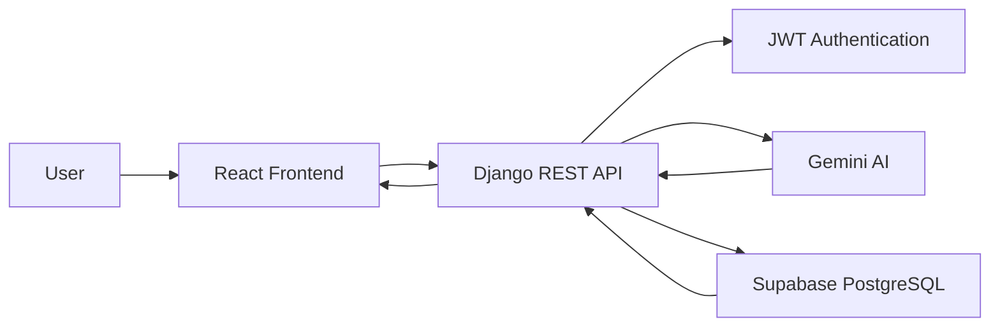

# CareRide AI ♿

> Connecting elderly individuals, persons with disabilities, and patients with verified helpers and AI-powered transportation recommendations.


---

# Table of Contents

* Problem Statement
* Features
* Tech Stack
* Architecture
* Setup Guide
* API Documentation
* API Testing
* Project Status
* Screenshots
* Live Demo
* Contributing
* Author
* License

---

# Problem Statement

Elderly individuals, persons with disabilities, and patients frequently struggle to find transportation that is safe, verified, and suited to their specific needs. Existing transportation services rarely account for accessibility requirements or offer any guarantee that a driver or helper is trustworthy and trained to assist.

CareRide AI closes this gap by connecting riders with verified helpers and using AI-powered recommendations to match each request with the most suitable helper, reducing risk and friction for some of the most vulnerable users of transportation services.

---

# Features

* Secure User Authentication using JWT
* Passenger and Helper Management
* Travel Request Booking System
* AI-Powered Helper Recommendations
* Supabase PostgreSQL Integration
* Swagger/OpenAPI Documentation
* MkDocs Documentation Website
* RESTful API Architecture
* GitHub Actions Continuous Integration

---

# Tech Stack

| Layer          | Technology                    |
| -------------- | ----------------------------- |
| Frontend       | React.js, Tailwind CSS        |
| Backend        | Django, Django REST Framework |
| Database       | PostgreSQL (Supabase)         |
| Authentication | JWT                           |
| AI             | Google Gemini API             |
| API Docs       | Swagger (drf-spectacular)     |
| Project Docs   | MkDocs                        |
| CI/CD          | GitHub Actions                |

---

# Architecture



---

# Setup Guide

## Prerequisites

* Python 3.10+
* Node.js 18+
* Git
* Supabase Project
* Google Gemini API Key

---

## Clone Repository

```bash
git clone https://github.com/Nashap/CareRide-AI.git
cd CareRide-AI
```

## Create Virtual Environment

```bash
python -m venv venv
```

### Windows

```bash
venv\Scripts\activate
```

### Linux / Mac

```bash
source venv/bin/activate
```

---

## Install Backend Dependencies

```bash
cd backend
pip install -r requirements.txt
```

---

## Configure Environment Variables

Create a `.env` file inside the backend directory.

```env
SECRET_KEY=your_secret_key

DEBUG=True

SUPABASE_URL=your_supabase_url

SUPABASE_KEY=your_supabase_key

GEMINI_API_KEY=your_gemini_api_key
```

---

## Run Migrations

```bash
python manage.py migrate
```

---

## Start Backend Server

```bash
python manage.py runserver
```

Backend URL:

```text
http://127.0.0.1:8000/
```

---

## Start Frontend

```bash
cd frontend

npm install

npm run dev
```

Frontend URL:

```text
http://localhost:5173/
```

---

# API Documentation

### Swagger UI

```text
http://127.0.0.1:8000/api/schema/swagger-ui/
```

### OpenAPI Schema

```text
http://127.0.0.1:8000/api/schema/
```

---

# API Testing

The API endpoints are documented and tested using Postman.

### Available Collections

* Authentication APIs
* Helper APIs
* Travel Request APIs
* AI Recommendation APIs

### Postman Collection

Coming Soon

---

# Project Status

Current Development Progress:

* User Authentication Completed
* Helper Management Completed
* Travel Request APIs Completed
* Supabase Integration Completed
* Gemini AI Integration Completed
* AI Recommendation Storage Completed
* Swagger Documentation Completed
* MkDocs Documentation Completed
* React Frontend In Progress

---

# Screenshots

## Swagger Documentation

*Add screenshot here*

## AI Recommendation Endpoint

*Add screenshot here*

## MkDocs Documentation

*Add screenshot here*

---

# Live Demo

| Service  | URL         |
| -------- | ----------- |
| Frontend | Coming Soon |
| Backend  | Coming Soon |

---

# Contributing

Contributions are welcome.

Please read the CONTRIBUTING.md file before submitting pull requests.

---

# Author

**Nasha P**

AI & Full-Stack Developer

GitHub:

https://github.com/Nashap

Project Repository:

https://github.com/Nashap/CareRide-AI

---

# License

This project is developed as part of an AI and Full-Stack Development Internship project.
