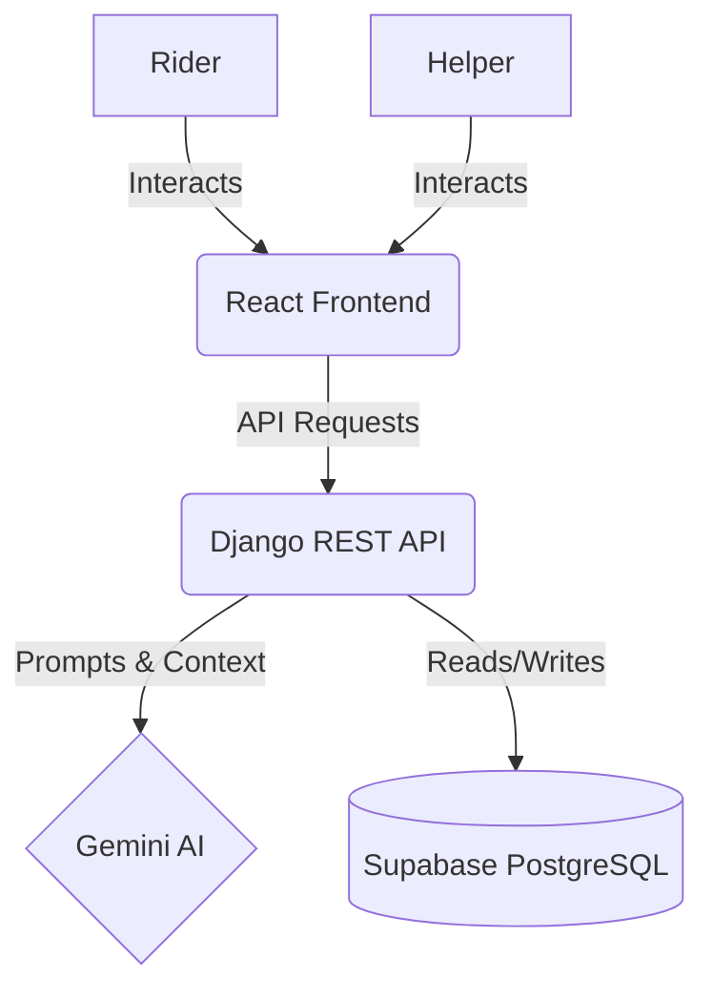
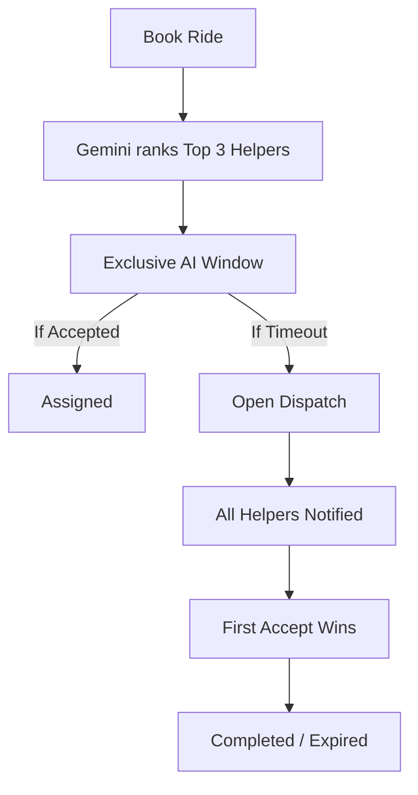

---

# CareRide AI ♿

> Connecting elderly individuals, persons with disabilities, and patients with verified helpers through a full-stack AI-powered mobility assistance and transportation platform.


---

## 📖 Project Description

CareRide AI is a modern, full-stack accessibility ride assistance platform. It intelligently bridges the gap between passengers with specific mobility needs and verified, capable helpers. Utilizing Google Gemini AI, CareRide streamlines the ride-matching process, assigning the right helper based on real-time availability, skill matching, and passenger requirements, ensuring a safe and reliable transportation experience.

---

## 🎯 Problem Statement

Existing transportation services often fail to cater to the specialized needs of elderly individuals, persons with disabilities, and medical patients. They lack trained personnel, appropriate vehicle accessibility, and a system to effectively pair passengers with helpers who can provide necessary support.

CareRide AI solves this by introducing an intelligent matchmaking system. By analyzing the passenger's specific requirements (e.g., wheelchair assistance, medical condition) and the helper's qualifications, AI ensures the most competent and suitable helper is dispatched, elevating the safety and quality of the ride.

---

## ✨ Features

### 🧑‍🦽 Rider Features
* **Book Ride:** Easily schedule rides with specific requirements.
* **AI Helper Recommendation:** Get matched with the best available helpers based on your needs.
* **AI Assistant:** An intelligent chatbot to guide you through the process and answer queries.
* **SOS:** Emergency alert system for immediate assistance.
* **Ride History:** Track past rides and helper interactions.
* **Disability Certificate Upload:** Securely upload and manage disability certificates for verification.
* **Rider Dashboard:** Centralized hub for managing rides and profile.

### 🤝 Helper Features
* **Browse Requests:** View available ride requests in real-time.
* **AI Priority Requests:** Receive exclusive, high-priority ride requests chosen by the AI.
* **Accept Ride:** Seamlessly accept ride assignments.
* **Complete Ride:** Update ride status and manage completed journeys.
* **Assigned Ride Dashboard:** Keep track of all active and upcoming assignments.

### 🧠 AI Features
* **Gemini AI Recommendation:** Advanced helper ranking based on multi-factor analysis.
* **AI Chat Assistant:** Context-aware chatbot for natural interactions.
* **Intelligent Helper Ranking:** Scores and sorts helpers based on best fit.
* **Smart Assignment Workflow:** Automated transition between AI exclusive matching and open dispatch.

---

## 🛠️ Tech Stack

| Layer | Technology |
| --- | --- |
| **Frontend** | React.js, Tailwind CSS |
| **Backend** | Django, Django REST Framework |
| **Database** | PostgreSQL (Supabase) |
| **Authentication** | JWT (JSON Web Tokens) |
| **AI Integration** | Google Gemini API |
| **API Documentation**| Swagger (drf-spectacular), MkDocs |
| **Testing** | Pytest, Pytest-Django, Pytest-Cov |
| **CI/CD** | GitHub Actions |
| **Deployment** | Railway |

---

## 🏗️ Architecture



---

## 🤖 AI Recommendation Workflow



---

## 📂 Project Structure

```text
CareRide-AI/
├── backend/                  # Django REST API
│   ├── ai_services/          # Gemini AI integration and chat
│   ├── care_ride/            # Core project settings
│   ├── helpers/              # Helper management app
│   ├── rides/                # Ride booking and assignment logic
│   ├── users/                # User authentication and profiles
│   ├── requirements.txt      # Python dependencies
│   └── manage.py             # Django management script
├── frontend/                 # React application
│   ├── src/                  # React components, pages, and context
│   ├── public/               # Static assets
│   ├── package.json          # Node dependencies
│   └── tailwind.config.js    # Tailwind CSS configuration
├── docs/                     # Documentation images and resources
├── .github/workflows/        # GitHub Actions CI/CD pipelines
├── mkdocs.yml                # MkDocs configuration
└── README.md                 # Project documentation
```

---

## 🚀 Installation

### Prerequisites
* Python 3.10+
* Node.js 18+
* Git
* Supabase Account
* Google Gemini API Key

### Clone Repository
```bash
git clone https://github.com/Nashap/CareRide-AI.git
cd CareRide-AI
```

### Backend Setup

1. **Create Virtual Environment**
   ```bash
   python -m venv venv
   ```
   *Windows:* `venv\Scripts\activate`
   *Linux / Mac:* `source venv/bin/activate`

2. **Install Dependencies**
   ```bash
   cd backend
   pip install -r requirements.txt
   ```

3. **Configure Environment Variables**
   Create a `.env` file inside the `backend` directory (see the [Environment Variables](#-environment-variables) section below).

4. **Run Database Migrations**
   ```bash
   python manage.py migrate
   ```

5. **Start Backend Server**
   ```bash
   python manage.py runserver
   ```
   *Backend URL:* `http://127.0.0.1:8000/`

### Frontend Setup

1. **Install Dependencies**
   ```bash
   cd ../frontend
   npm install
   ```

2. **Start Frontend Server**
   ```bash
   npm run dev
   ```
   *Frontend URL:* `http://localhost:5173/`

---

## 🔐 Environment Variables

Create a `.env` file in the `backend` directory with the following variables:

| Variable | Description | Example |
| --- | --- | --- |
| `SECRET_KEY` | Django Secret Key | `your_secret_key` |
| `DEBUG` | Enable/Disable Debug Mode | `True` |
| `SUPABASE_URL` | Supabase Project URL | `https://your-project.supabase.co` |
| `SUPABASE_KEY` | Supabase API Key | `your_supabase_key` |
| `GEMINI_API_KEY`| Google Gemini API Key | `your_gemini_api_key` |

---

## 📚 API Documentation

* **Swagger UI:** [https://careride-ai-production.up.railway.app/api/schema/swagger-ui/](https://careride-ai-production.up.railway.app/api/schema/swagger-ui/)
* **Postman Collection:** [View API Collection](https://documenter.getpostman.com/view/55567557/2sBXwvH81g)
* **MkDocs Documentation:** Run `mkdocs serve` and visit `http://127.0.0.1:8001/`

---

## 🧪 Testing

CareRide AI uses robust testing practices to ensure reliability.

* **Pytest:** Used for all unit and integration tests.
* **Coverage:** Pytest-Cov tracks test coverage, aiming for high reliability.
* **GitHub Actions:** CI pipeline runs all tests automatically.
* **Mocked AI Tests:** External AI services (Gemini) are fully mocked during testing to prevent real network requests and ensure predictable test outcomes.

**Run tests with coverage:**
```bash
cd backend
pytest --cov=. --cov-report=term
```

---

## ☁️ Deployment

* **Railway:** The Django REST backend and Swagger documentation are deployed on Railway.
* **Frontend:** Deployed securely for user access (production setup pending).
* **Production URL:** [https://careride-ai-production.up.railway.app/](https://careride-ai-production.up.railway.app/)

---

## 📸 Screenshots

*(Add your images to the `docs/images/` folder to display them here)*

* **Home Page:** 
  ``
* **Rider Dashboard:** 
  ``
* **Helper Dashboard:** 
  ``
* **AI Recommendation:** 
  ``
* **AI Assistant:** 
  ``
* **Profile:** 
  ``
* **Swagger API Docs:** 
  ``

---

## 🚀 Future Enhancements

* Real-time GPS Tracking
* AI Route Optimization
* OCR Processing for Disability Certificates
* Mobile Application
* Push Notifications
* Voice Assistant

---

## 👨‍💻 Author

**Nasha P**
AI & Full-Stack Developer
* GitHub: [https://github.com/Nashap](https://github.com/Nashap)
* Project Repository: [https://github.com/Nashap/CareRide-AI](https://github.com/Nashap/CareRide-AI)

---

## 📄 License

This project is developed as part of an AI and Full-Stack Development Internship project.
For educational and demonstration purposes.
