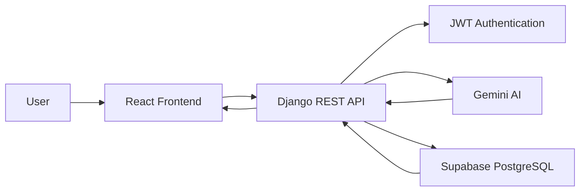
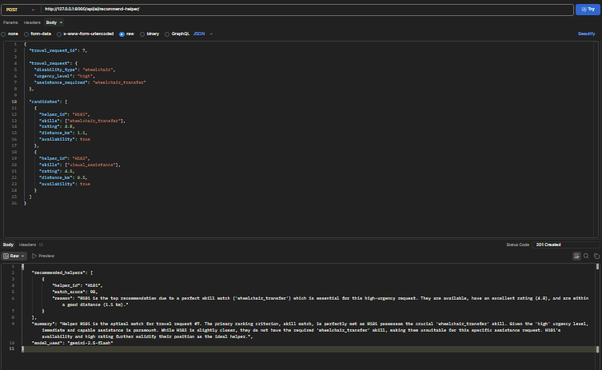

# CareRide AI ♿

> Connecting elderly individuals, persons with disabilities, and patients with verified helpers through AI-powered mobility assistance and transportation recommendations.


---

# Table of Contents

* Problem Statement
* Features
* Tech Stack
* Architecture
* Setup Guide
* API Documentation
* API Testing
* Project Status
* Screenshots
* Live Demo
* Contributing
* Author
* License

---

# Problem Statement

Elderly individuals, persons with disabilities, and patients often face challenges in accessing safe, reliable, and accessible transportation. Existing transportation services rarely provide specialized assistance or guarantee that helpers are trained to support users with mobility needs.

CareRide AI addresses this problem by connecting passengers with verified helpers and using AI-powered recommendations to identify the most suitable helper based on travel requirements, skills, distance, urgency, ratings, and availability.

---

# Features

* Secure User Authentication using JWT
* Passenger Management
* Helper Management
* Travel Request Booking System
* AI-Powered Helper Recommendations
* Gemini AI Integration
* Supabase PostgreSQL Integration
* Swagger/OpenAPI Documentation
* MkDocs Documentation Website
* RESTful API Architecture
* GitHub Actions Continuous Integration

---

# Tech Stack

| Layer                 | Technology                    |
| --------------------- | ----------------------------- |
| Frontend              | React.js, Tailwind CSS        |
| Backend               | Django, Django REST Framework |
| Database              | PostgreSQL (Supabase)         |
| Authentication        | JWT                           |
| AI                    | Google Gemini API             |
| API Documentation     | Swagger (drf-spectacular)     |
| Project Documentation | MkDocs                        |
| CI/CD                 | GitHub Actions                |

---

# Architecture



---

# Setup Guide

## Prerequisites

* Python 3.10+
* Node.js 18+
* Git
* Supabase Account
* Google Gemini API Key

---

## Clone Repository

```bash
git clone https://github.com/Nashap/CareRide-AI.git
cd CareRide-AI
```

---

## Create Virtual Environment

```bash
python -m venv venv
```

### Windows

```bash
venv\Scripts\activate
```

### Linux / Mac

```bash
source venv/bin/activate
```

---

## Install Backend Dependencies

```bash
cd backend
pip install -r requirements.txt
```

---

## Configure Environment Variables

Create a `.env` file inside the backend directory.

```env
SECRET_KEY=your_secret_key

DEBUG=True

SUPABASE_URL=your_supabase_url

SUPABASE_KEY=your_supabase_key

GEMINI_API_KEY=your_gemini_api_key
```

---

## Run Database Migrations

```bash
python manage.py migrate
```

---

## Start Backend Server

```bash
python manage.py runserver
```

Backend URL:

```text
http://127.0.0.1:8000/
```

---

## Start Frontend

```bash
cd frontend

npm install

npm run dev
```

Frontend URL:

```text
http://localhost:5173/
```

### MkDocs Documentation

# API Documentation

### Swagger UI

http://127.0.0.1:8000/api/schema/swagger-ui/

### OpenAPI Schema

http://127.0.0.1:8000/api/schema/

### MkDocs Documentation
http://127.0.0.1:8000/
Run:

```bash
mkdocs serve
```

Then visit:

```text
http://127.0.0.1:8001/
```

---

# API Testing

The API endpoints are documented and tested using Postman.

### Available Collections

* Authentication APIs
* Helper APIs
* Travel Request APIs
* AI Recommendation APIs

### Postman Collection

(https://documenter.getpostman.com/view/55567557/2sBXwvH81g)

---

# Project Status

Current Development Progress:

* User Authentication Completed
* Helper Management Completed
* Travel Request APIs Completed
* Supabase Integration Completed
* Gemini AI Integration Completed
* AI Recommendation Engine Completed
* AI Recommendation Storage Completed
* Swagger Documentation Completed
* MkDocs Documentation Completed
* GitHub Actions CI Configured
* React Frontend In Progress

---

# Screenshots

## Swagger Documentation


## AI Recommendation Endpoint



## MkDocs Documentation


---

# Live Demo

| Service  | URL         |
| -------- | ----------- |
| Frontend | Coming Soon |
| Backend  | Coming Soon |

---

# Contributing

Contributions are welcome and appreciated.

Please read the `CONTRIBUTING.md` file before creating issues or submitting pull requests.

---

# Author

**Nasha P**

AI & Full-Stack Developer

GitHub:
https://github.com/Nashap

Project Repository:
https://github.com/Nashap/CareRide-AI

---

# License

This project is developed as part of an AI and Full-Stack Development Internship project.

For educational and demonstration purposes.
