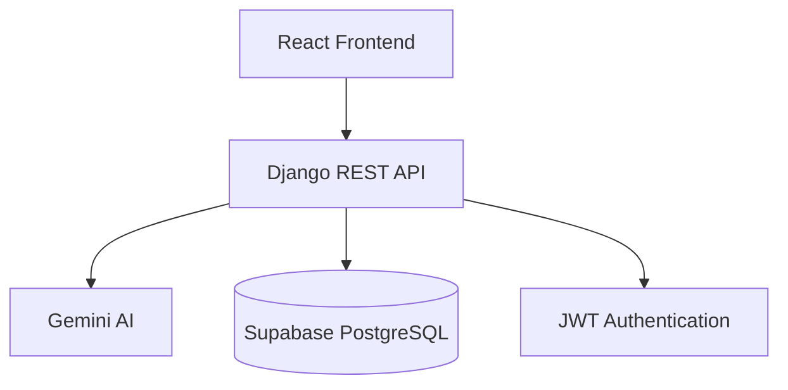
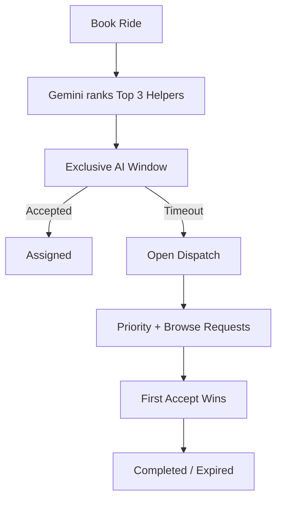
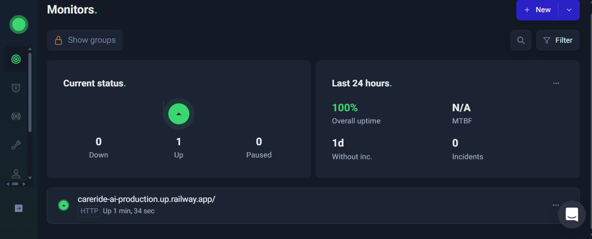
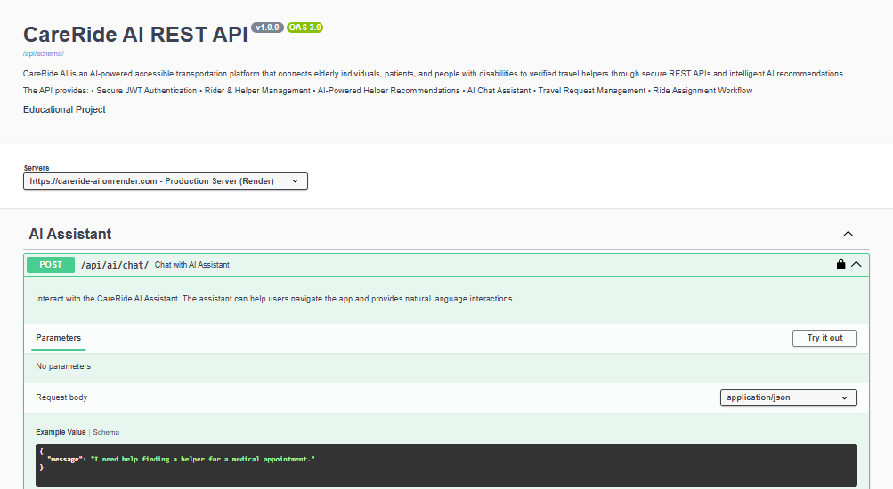
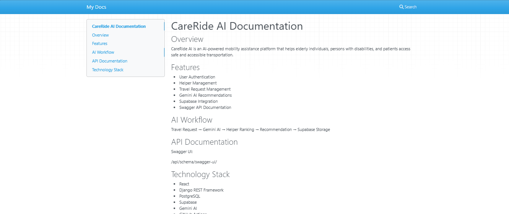
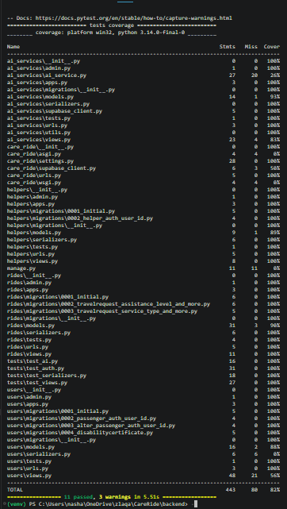

# CareRide AI ♿

> Connecting elderly individuals, persons with disabilities, and patients with verified helpers through a full-stack AI-powered mobility assistance and transportation platform.


---

## Table of Contents

* [Problem Statement](#-problem-statement)
* [Project Overview](#-project-overview)
* [Live Deployment](#-live-deployment)
* [Project Status](#-project-status)
* [Features](#-features)
* [Tech Stack](#️-tech-stack)
* [Architecture](#️-architecture)
* [AI Recommendation Workflow](#-ai-recommendation-workflow)
* [Project Structure](#-project-structure)
* [Installation](#-installation)
* [Environment Variables](#-environment-variables)
* [API Documentation & Testing](#-api-documentation--testing)
* [Production Monitoring](#-production-monitoring)
* [Screenshots](#-screenshots)
* [Future Enhancements](#-future-enhancements)
* [Contributing](#-contributing)
* [Author](#-author)
* [License](#-license)

---

## 📖 Problem Statement

Elderly individuals, persons with disabilities, and patients often face challenges in accessing safe, reliable, and accessible transportation. Existing transportation services rarely provide specialized assistance or guarantee that helpers are trained to support users with mobility needs. CareRide AI addresses this problem by connecting passengers with verified helpers and using AI-powered recommendations to identify the most suitable helper based on travel requirements, skills, urgency, ratings, and availability.

## 📖 Project Overview

CareRide AI is a modern, complete Full-Stack AI application. It intelligently bridges the gap between passengers with specific mobility needs and verified, capable helpers. The React frontend is fully built out and deployed, alongside a Django REST backend, giving the platform an end-to-end working experience for both riders and helpers.

CareRide AI consists of:
* **React Frontend** — completed and deployed on Vercel
* **Django REST Backend** — deployed on Railway
* **Supabase PostgreSQL**
* **Gemini AI**

---

## 🚀 Live Deployment

| Service | URL |
| --- | --- |
| **Frontend** | [https://careride-six.vercel.app/](https://careride-six.vercel.app/) |
| **Backend** | [https://careride-ai-production.up.railway.app/](https://careride-ai-production.up.railway.app/) |
| **Swagger** | [https://careride-ai-production.up.railway.app/api/schema/swagger-ui/](https://careride-ai-production.up.railway.app/api/schema/swagger-ui/) |
| **Postman** | [https://documenter.getpostman.com/view/55567557/2sBXwvH81g](https://documenter.getpostman.com/view/55567557/2sBXwvH81g) |

---

## 📊 Project Status

**React Frontend Completed**

* ✅ User Authentication
* ✅ Helper Management
* ✅ Travel Request APIs
* ✅ Supabase Integration
* ✅ Gemini AI Integration
* ✅ AI Recommendation Engine & Storage
* ✅ AI Recommendation Workflow
* ✅ Rider Dashboard
* ✅ Helper Dashboard
* ✅ Ride Assignment Workflow
* ✅ Disability Certificate Upload
* ✅ Swagger Documentation
* ✅ MkDocs Documentation
* ✅ Automated Test Suite — 82% Code Coverage
* ✅ GitHub Actions CI Configured
* ✅ Railway Deployment (Backend)
* ✅ Vercel Deployment (Frontend)
* ✅ UptimeRobot Monitoring Configured

---

## ✨ Features

### 🧑‍🦽 Rider Features
* Register & Login
* Book Ride
* AI Helper Recommendation
* AI Assistant Chatbot
* Ride Status Tracking
* Ride History
* Disability Certificate Upload & Secure Viewing
* Profile Management

### 🤝 Helper Features
* Register & Login
* Browse Requests
* AI Priority Requests
* Accept Ride
* Assigned Ride Dashboard
* Complete Ride
* View Assigned Rider Contact
* Secure Disability Certificate Viewing (Assigned rides only)

### 🧠 AI Features
* Gemini AI Helper Recommendation — ranks the **Top 3** most suitable helpers per ride
* Exclusive Priority Window — ranked helpers get first right of acceptance before the ride opens up
* Open Dispatch Fallback — if the priority window times out, the ride opens to general Browse Requests on a first-accept basis
* Intelligent Helper Ranking based on skills, ratings, and availability
* AI Chat Assistant

### 🔒 Platform & Security
* Secure Authentication using JWT
* Rate Limiting with django-ratelimit
* Custom Serializer Validation
* CORS Security Configuration
* OWASP Security Review
* Performance Testing (50 Rapid API Requests)

---

## 🛠️ Tech Stack

| Layer | Technology |
| --- | --- |
| **Frontend** | React.js, Tailwind CSS |
| **Backend** | Django, Django REST Framework |
| **Database** | Supabase PostgreSQL |
| **Authentication** | JWT |
| **AI** | Google Gemini API |
| **API Documentation** | Swagger (drf-spectacular) |
| **Project Documentation** | MkDocs |
| **Testing** | Pytest, Pytest-Django, Pytest-Cov |
| **CI/CD** | GitHub Actions |
| **Deployment** | Railway (Backend), Vercel (Frontend) |

---

## 🏗️ Architecture



---

## 🤖 AI Recommendation Workflow



---

## 📂 Project Structure

```text
CareRide-AI/
├── backend/                  # Django REST API
│   ├── ai_services/          # Gemini AI integration and chat
│   ├── care_ride/            # Core project settings
│   ├── helpers/              # Helper management app
│   ├── rides/                # Ride booking and assignment logic
│   ├── users/                # User authentication and profiles
│   ├── requirements.txt      # Python dependencies
│   └── manage.py             # Django management script
├── frontend/                 # React application
│   ├── src/                  # React components, pages, and context
│   ├── public/                # Static assets
│   ├── package.json          # Node dependencies
│   └── tailwind.config.js    # Tailwind CSS configuration
├── docs/                      # Documentation images and resources
├── .github/workflows/         # GitHub Actions CI/CD pipelines
├── mkdocs.yml                 # MkDocs configuration
└── README.md                  # Project documentation
```

---

## 🚀 Installation

### Prerequisites
* Python 3.10+
* Node.js 18+
* Git
* Supabase Account
* Google Gemini API Key

### Clone Repository
```bash
git clone https://github.com/Nashap/CareRide-AI.git
cd CareRide-AI
```

### Backend Setup

1. **Create Virtual Environment**
   ```bash
   python -m venv venv
   ```
   *Windows:* `venv\Scripts\activate`
   *Linux / Mac:* `source venv/bin/activate`

2. **Install Dependencies**
   ```bash
   cd backend
   pip install -r requirements.txt
   ```

3. **Configure Environment Variables**
   Create a `.env` file inside the `backend` directory (see [Environment Variables](#-environment-variables) below).

4. **Run Database Migrations**
   ```bash
   python manage.py migrate
   ```

5. **Start Backend Server**
   ```bash
   python manage.py runserver
   ```
   *Backend URL:* `http://127.0.0.1:8000/`

### Frontend Setup

1. **Install Dependencies**
   ```bash
   cd ../frontend
   npm install
   ```

2. **Start Frontend Server**
   ```bash
   npm run dev
   ```
   *Frontend URL:* `http://localhost:5173/`

---

## 🔐 Environment Variables

Create a `.env` file in the `backend` directory with the following variables:

| Variable | Description | Example |
| --- | --- | --- |
| `SECRET_KEY` | Django Secret Key | `your_secret_key` |
| `DEBUG` | Enable/Disable Debug Mode | `True` |
| `SUPABASE_URL` | Supabase Project URL | `https://your-project.supabase.co` |
| `SUPABASE_KEY` | Supabase API Key | `your_supabase_key` |
| `GEMINI_API_KEY` | Google Gemini API Key | `your_gemini_api_key` |

---

## 📚 API Documentation & Testing

* **Swagger UI:** [View Swagger Docs](https://careride-ai-production.up.railway.app/api/schema/swagger-ui/)
* **OpenAPI Schema:** `http://127.0.0.1:8000/api/schema/`
* **Postman Collection:** [View API Collection](https://documenter.getpostman.com/view/55567557/2sBXwvH81g)
* **MkDocs Documentation:** Run `mkdocs serve` and visit `http://127.0.0.1:8001/`

### Available Postman Collections
* Authentication APIs
* Helper APIs
* Travel Request APIs
* AI Recommendation APIs

### Testing

CareRide AI uses **Pytest**, **Pytest-Django**, and **Pytest-Cov** for automated testing.

* Serializer Unit Tests
* View Unit Tests
* Authentication Flow Tests
* AI Recommendation Integration Test (Mocked Gemini API — external AI calls are fully mocked to prevent real network requests and ensure predictable test outcomes)
* GitHub Actions CI Testing

**Current coverage: 82%** — 11 tests passed, 0 failed.

```bash
# Run tests
pytest

# Run tests with coverage
pytest --cov=. --cov-report=term

# Generate HTML coverage report
pytest --cov=. --cov-report=html
```

Generated report: `htmlcov/index.html`


---

## 📡 Production Monitoring

The CareRide AI production deployment is continuously monitored using **UptimeRobot** to ensure service availability and uptime tracking.

| Detail | Value |
| --- | --- |
| Monitoring Type | HTTP(s) |
| Monitoring Interval | 5 Minutes |
| Current Status | Operational |
| Uptime | 100% |



---

## 📸 Screenshots


### 🧑‍🦽 Rider Experience
| Screen | Preview |
| --- | --- |
| Login / Register |  |
| Book Ride |  |
| AI Helper Recommendation (Top 3 Ranking) |  |
| AI Chat Assistant |  |
| Ride Status Tracking |  |
| Ride History |  |
| Disability Certificate Upload |  |
| Rider Profile |  |

### 🤝 Helper Experience
| Screen | Preview |
| --- | --- |
| Login / Register |  |
| Browse Requests |  |
| AI Priority Requests |  |
| Assigned Ride Dashboard |  |
| View Assigned Rider Contact |  |
| Secure Disability Certificate Viewing (Assigned only) |  |
| Complete Ride |  |

### ⚙️ Platform & Ops
| Screen | Preview |
| --- | --- |
| Swagger Documentation |  |
| MkDocs Documentation |  |
| Test Coverage Report |  |
| UptimeRobot Monitoring |  |

### 📱 Mobile View
| Screen | Preview |
| --- | --- |
| Responsive Rider Dashboard |  |

---

## 🚀 Future Enhancements

* Live GPS Tracking
* AI Route Optimization
* OCR Processing for Disability Certificates
* Mobile App
* Push Notifications
* Voice Assistant

---

## 🤝 Contributing

Contributions are welcome and appreciated. Please read the `CONTRIBUTING.md` file before creating issues or submitting pull requests.

---

## 👨‍💻 Author

**Nasha P**
AI & Full-Stack Developer
* GitHub: [https://github.com/Nashap](https://github.com/Nashap)
* Project Repository: [https://github.com/Nashap/CareRide-AI](https://github.com/Nashap/CareRide-AI)

---

## 📄 License

This project is developed as part of an AI and Full-Stack Development Internship project.
For educational and demonstration purposes.
